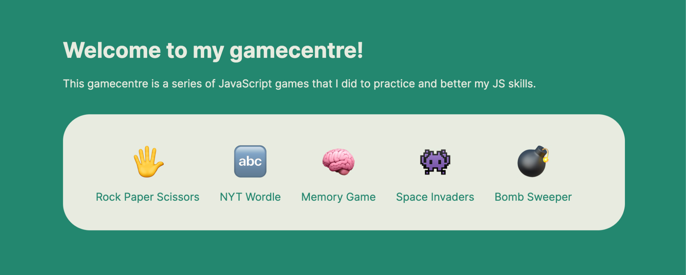

<H1>Games in JavaScript 🎲
</H1>

<h2>Description:</h2>

I made this repository to store all the games that I made in JavaScript. I believe that coding games enable you to think more analytically about the game mechanism and they are a great practice to improve your coding skills.
In this repository, I made sure to practice many JavaScript fundamentals such as operations with arrays and objects etc.

<h2>Key Features:</h2>
<ul>
<li>
Rock Paper Scissors ✋</li>
<li>
Memory Game 🧠</li>
<li>Wordle 🔤</li>
<li>Space Invaders 👾</li>
<li>currently working on: Bombsweeper 💣</li>

</ul>

<h2>Technologies Used:</h2>
<ul>
<li>HTML, CSS, JavaScript</li>
</ul>

<h2>Getting Started:</h2>

To begin using games-js, follow these steps:

<ol>
<li>Clone the games.js repository from GitHub.
</li>
<li>Install necessary dependencies using npm.
</li>
<li>Run the application locally with npx serve.
</li>
<li>Enjoy playing!
</li>
</ol>

> [!NOTE]
>
> <ul>
> <li>Work-in–Progress.

> </li>
